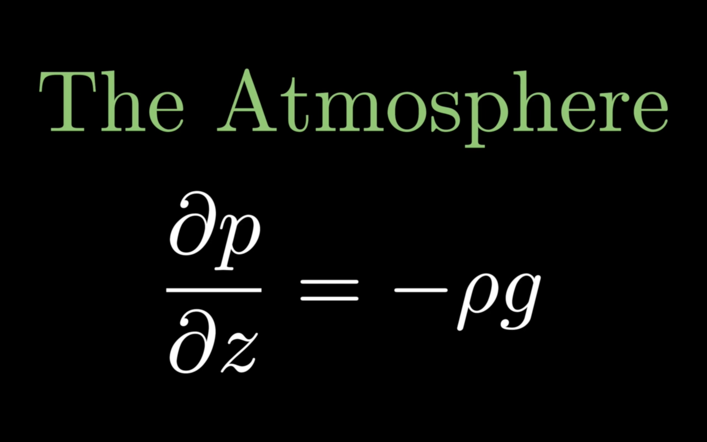

# The Atmosphere | Aerprize 2020
 
> An explainer video built with 3blue1brown's manim.

[](https://youtu.be/X9rHrt3XpWg)

This is the source code for the animation that I created for the [AerPrize](http://www.aerprize.com), competition. It was developed with manim, an animation engine for explanatory math videos, created by the YouTuber, [3blue1brown](https://www.youtube.com/channel/UCYO_jab_esuFRV4b17AJtAw).

## Creating The Animations

To successfully built the animations, you must first install manim. Manim changes quite regularly, with code written for previous versions of manim not functioning in future. Therefore, I highly recommend installing the same version of manim that I used. The [version](https://github.com/3b1b/manim/tree/30728879be4aa3b8c8da80ae3bf8ebe7a0eee484) I utilised was released on the 3rd of February, and can be installed using the following code: 

```bash
$ git clone https://github.com/3b1b/manim
$ cd manim
$ git reset --hard 30728879be4aa3b8c8da80ae3bf8ebe7a0eee484
```

Please ensure you follow the installations instructions provided with the software. Once installed successfully, clone this repository and generated the animations. You can use the following code if you are running on macOS or Linux:

```bash
$ git clone https://github.com/conorcaseyc/the-atmosphere.git
$ cd the-atmosphere
$ sh make.sh
```

I cannot guarantee that the animations will still build correctly in the future, however, if you have any problems, please do not hesitate to create an issue, or pull request.
